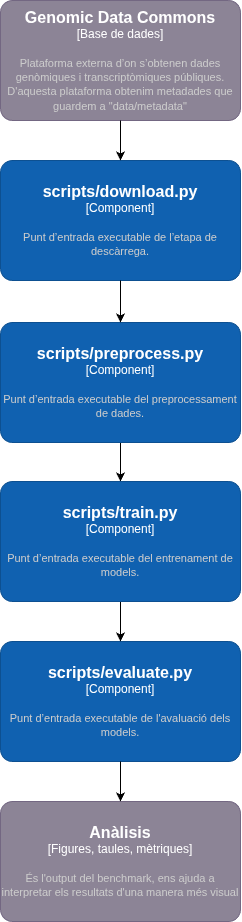

# TCGA-COAD CMS ML Pipeline

Aquest lloc documenta un pipeline de machine learning per classificar mostres de càncer colorectal del projecte TCGA-COAD en subtipus moleculars CMS a partir de dades d’expressió gènica RNA-seq.

La documentació se centra en l’ús tècnic del projecte: instal·lació, execució, estructura del pipeline, dades utilitzades, experiments, resultats i criteris de reproductibilitat.

## Què fa el projecte?

El projecte construeix un flux complet des de fitxers RNA-seq descarregats del Genomic Data Commons fins a una comparativa de models supervisats. El pipeline prepara les dades, entrena diferents classificadors i avalua el rendiment amb un conjunt de test separat.

El resultat final és una comparació entre tres models:

| Model | Família | Paper dins del projecte |
|---|---|---|
| Logistic Regression | Model lineal | Baseline interpretable |
| Random Forest | Ensemble d’arbres | Model robust en alta dimensionalitat |
| SVM lineal | Màquines de vectors de suport | Model adequat quan hi ha molts més gens que mostres |

## Entrada i sortida principal

| Element | Descripció |
|---|---|
| Entrada principal | Fitxers RNA-seq STAR-Counts de TCGA-COAD i etiquetes CMS |
| Sortida del preprocessament | Matrius `X_train`, `X_test`, `y_train` i `y_test` |
| Sortida de l’entrenament | Models serialitzats en format `.joblib` |
| Sortida de l’avaluació | Mètriques, matrius de confusió i gràfics comparatius |

## Estructura de la documentació

La documentació s’organitza en quatre pàgines principals:

| Pàgina | Contingut |
|---|---|
| [Execució](execucio.md) | Instal·lació del projecte i comandes per executar el pipeline |
| [Dades i pipeline](pipeline.md) | Origen de les dades, estructura del repositori i arquitectura C4 |
| [Experiments i resultats](resultats.md) | Exploració, entrenament, mètriques i interpretació dels resultats |
| [Reproductibilitat i referència](referencia.md) | Seeds, fitxers versionats, requisits, criteris d’acceptació i glossari |

## Flux resumit

## Què queda fora de l’abast?

Aquest projecte no desenvolupa nous algorismes de machine learning, no fa alineament de lectures RNA-seq des de fitxers FASTQ i no realitza validació clínica dels resultats. El focus és construir un pipeline reproduïble i documentat per comparar models supervisats sota el mateix preprocessament i la mateixa partició de dades.

## Per començar

Per executar el projecte des de zero, consulta la pàgina [Execució](execucio.md). Per entendre el funcionament intern del pipeline i els diagrames C4, consulta [Dades i pipeline](pipeline.md).
