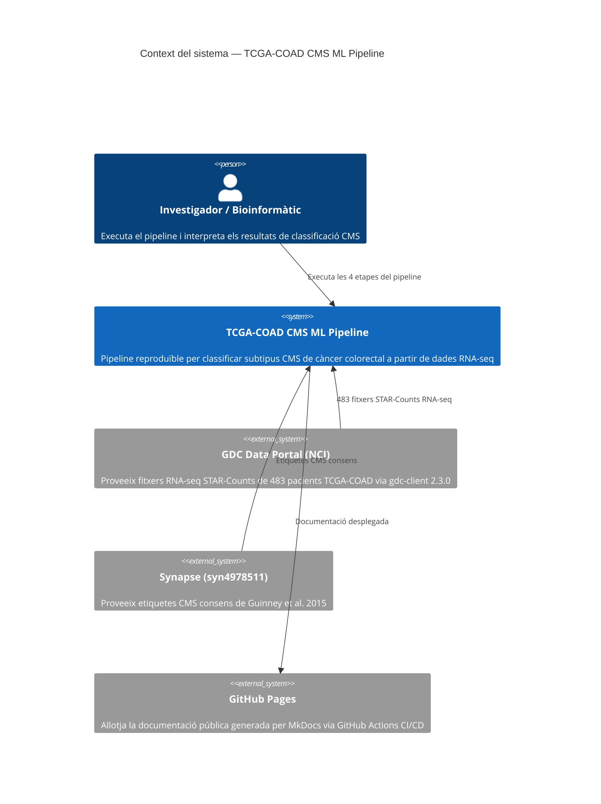
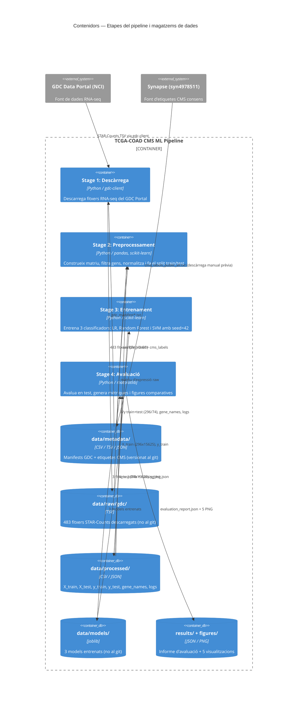
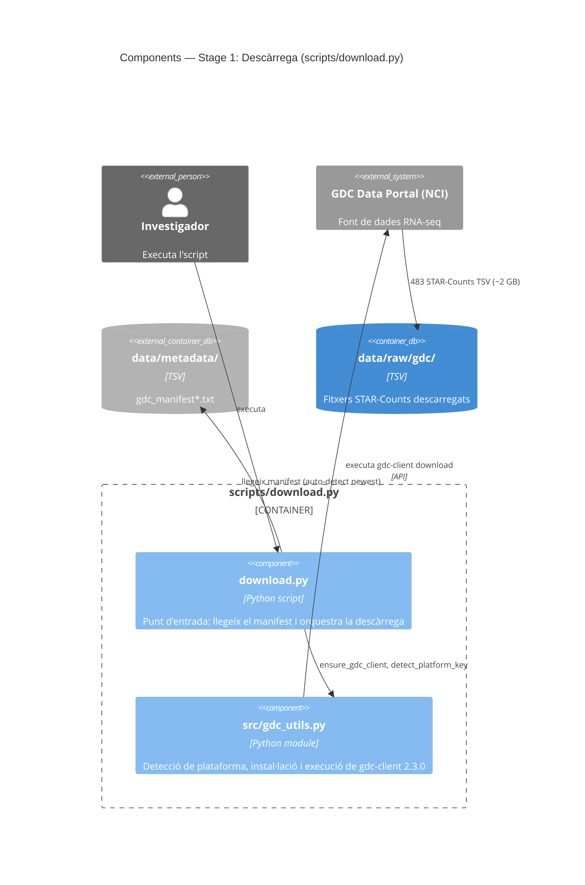
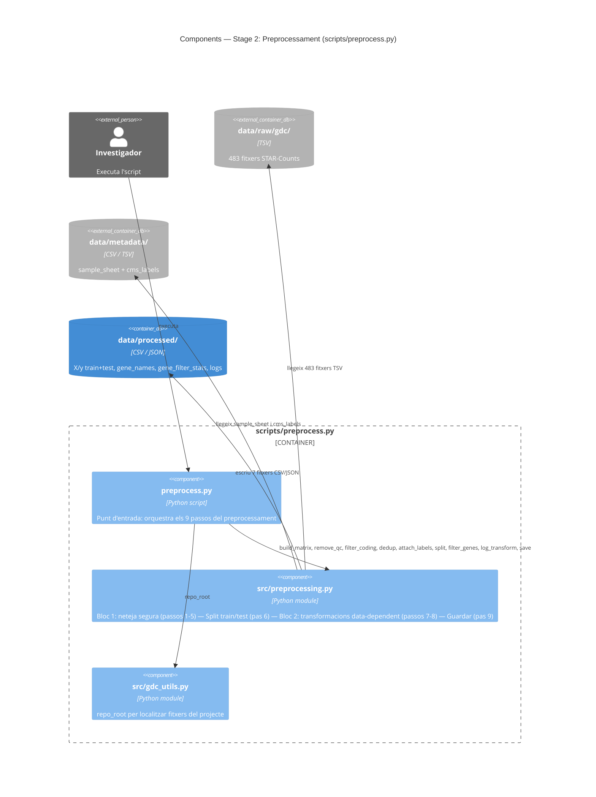
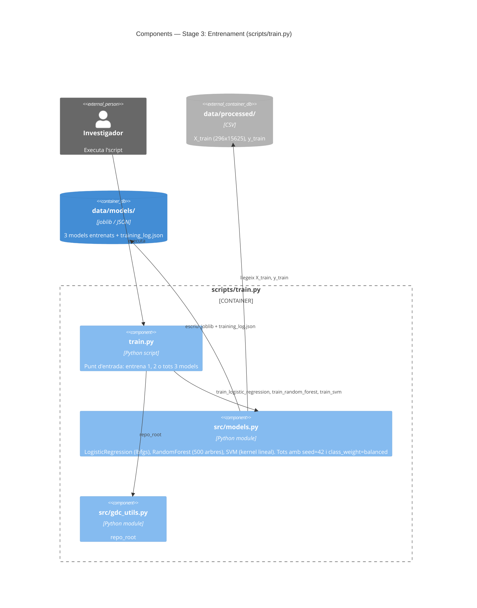
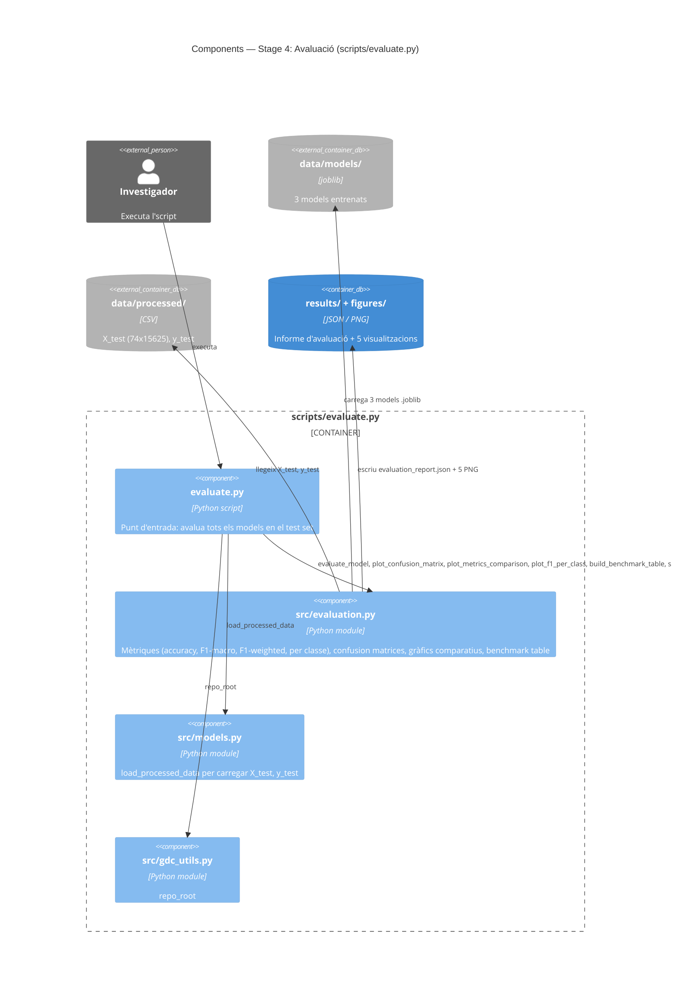

# Pipeline

## Visió general

El pipeline transforma dades d'expressió gènica en una comparativa de models de classificació.
Cada etapa és un script independent que es pot executar per separat.

```
Dades RNA-seq (TCGA-COAD)
        │
        ▼
   DESCÀRREGA ────────── scripts/download.py
   Descarrega fitxers       src/gdc_utils.py
   del GDC Portal
        │
        ▼
   PREPROCESSAMENT ───── scripts/preprocess.py
   Filtra gens sorollosos,   src/preprocessing.py
   normalitza, split
   train/test
        │
        ▼
   EXPLORACIÓ ─────────── notebooks/data_exploration.ipynb
   PCA + UMAP per             src/dimensionality_reduction.py
   verificar dades i
   avaluar separabilitat
        │
        ▼
   ENTRENAMENT ────────── scripts/train.py
   Entrena 3 models            src/models.py
   amb les mateixes dades
   i la mateixa seed
        │
        ▼
   AVALUACIÓ ──────────── scripts/evaluate.py
   Mètriques, gràfics,        src/evaluation.py
   taula comparativa
```

## Etapa 1: Descàrrega de dades

**Script:** `scripts/download.py`
**Mòdul:** `src/gdc_utils.py`

Descarrega les dades RNA-seq del GDC Data Portal usant el manifest que hi ha a `data/metadata/`.
Si l'eina `gdc-client` no està instal·lada, la descarrega i instal·la automàticament.

**Entrada:** manifest GDC (`data/metadata/gdc_manifest*.txt`)
**Sortida:** fitxers RNA-seq a `data/raw/gdc/`

Veure [Dades](data.md) per a més detalls sobre el dataset i els criteris de selecció.

## Etapa 2: Preprocessament

**Script:** `scripts/preprocess.py`
**Mòdul:** `src/preprocessing.py`

Transforma 483 fitxers de comptatge en un dataset net llest per entrenar models.
S'executa amb una sola comanda:

```bash
python scripts/preprocess.py
```

**Entrada:** fitxers RNA-seq a `data/raw/gdc/` + metadades a `data/metadata/`
**Sortida:** 6 fitxers a `data/processed/` (veure [sortida](#sortida-de-letapa-2))

### Visió general dels passos

El preprocessament es divideix en **dos blocs** separats pel train/test split.
Aquesta divisió és fonamental per evitar **data leakage** (veure nota més avall).

```
483 fitxers raw
      │
      ▼
  BLOC 1: Neteja segura (no mira valors d'expressió)
  ├── Pas 1: Construir matriu (60.664 gens × 483 fitxers)
  ├── Pas 2: Eliminar files QC — 4 files de metadades d'alineament
  ├── Pas 3: Filtrar gens protein-coding (60.660 → 19.962)
  ├── Pas 4: Deduplicar mostres (483 → 458)
  └── Pas 5: Unir amb etiquetes CMS (458 → 370)
      │
      ▼
  Pas 6: TRAIN/TEST SPLIT (296 train / 74 test, seed=42)
      │
      ▼
  BLOC 2: Transformacions (fit on train, apply to both)
  ├── Pas 7: Filtrar gens amb baix comptatge (19.962 → 15.625)
  └── Pas 8: Transformació log2(x + 1)
      │
      ▼
  Pas 9: Guardar tot a data/processed/
```

### Bloc 1: Neteja segura (abans del split)

Aquests passos **no generen data leakage** perquè les decisions es basen en
metadades o anotacions externes, no en la distribució dels valors d'expressió.

**Pas 1 — Construir matriu d'expressió (60.664 gens × 483 fitxers).** Cada fitxer STAR-Counts
conté 9 columnes. Nosaltres n'extraiem només una: `unstranded` (comptatges raw sense
distinció de cadena). Per què aquesta i no `tpm_unstranded` o `fpkm_unstranded`?

- **TPM/FPKM** ja estan normalitzats per longitud de gen i profunditat de seqüenciació.
  Això sembla convenient, però impedeix aplicar les nostres pròpies transformacions
  (filtratge per comptatge mínim, log2) de manera correcta.
- **Comptatges raw** permeten controlar tot el procés de normalització, que és el que
  volem en un pipeline reproduïble.

El pipeline llegeix cada fitxer TSV dins de `data/raw/gdc/<UUID>/`, n'extreu la columna
`unstranded`, i els combina en una matriu única on cada fila és un gen i cada columna
és un fitxer.

**Pas 2 — Eliminar 4 files QC.** Les primeres 4 files de cada fitxer STAR-Counts
no són gens reals, sinó estadístiques de l'alineament:

| Fila | Significat |
|------|-----------|
| `N_unmapped` | Lectures que no s'han pogut alinear al genoma |
| `N_multimapping` | Lectures que mapegen a múltiples ubicacions |
| `N_noFeature` | Lectures alineades però que no cauen dins de cap gen |
| `N_ambiguous` | Lectures que cauen en zones on es solapen gens |

Si les deixéssim, els algorismes de ML les tractarien com a gens reals. S'eliminen.

**Pas 3 — Filtrar gens protein-coding (60.660 → 19.962 gens, eliminats 40.698).**
L'anotació GENCODE v36 classifica cada gen per tipus. D'un total de ~60.660 gens,
només ~19.962 són de tipus `protein_coding` — la resta inclou:

- **lncRNA** (~16.000) — RNA llarg no codificant
- **Pseudogens** (~15.000) — còpies de gens que ja no es tradueixen
- **Altres** (~9.000) — miRNA, rRNA, snRNA, etc.

Per què els eliminem? La classificació CMS es basa en signatures d'expressió de
**proteïnes**. Els gens no codificants introdueixen dimensions addicionals (soroll)
sense aportar senyal discriminatiu, i augmenten el risc de sobreajustament.

**Pas 4 — Deduplicar mostres (483 → 458 mostres, eliminades 25).**
El dataset conté 483 fitxers però només 458 pacients únics. Els 25 fitxers sobrants
s'eliminen en tres passos:

| Tipus | Eliminades | Per què? |
|-------|-----------|---------|
| Mostres FFPE | 13 | La fixació en formalina (FFPE) altera el perfil d'expressió — les lectures RNA-seq d'FFPE tenen més degradació i biaixos que les de teixit congelat. Barrejar-les introduiria variabilitat tècnica, no biològica |
| Mostres no primàries | 2 | Una mostra metastàtica (06A) i una de recurrència (02A). El nostre objectiu és classificar tumors primaris (01A); metàstasis i recurrències tenen perfils d'expressió diferents |
| Duplicats per pacient | 10 | 10 pacients (sèrie A6-*) tenen 2 fitxers vàlids cadascun. Per a cada duplicat, es reté el fitxer amb **major profunditat de seqüenciació** (suma total de comptatges), perquè conté més informació |

Després d'aquest pas, tenim exactament **1 fitxer per pacient** (458 mostres).

**Pas 5 — Unir amb etiquetes CMS (458 → 370 mostres, descartades 88).**
Es fa un inner join entre la matriu i les etiquetes CMS de Guinney et al. 2015
(veure [Dades — Etiquetes CMS](data.md#etiquetes-cms-consensus-molecular-subtypes)).

No tots els pacients TCGA-COAD tenen etiqueta CMS — 88 no van ser inclosos a l'estudi
del consorci o van rebre etiqueta `NOLBL`/`UNK` (no classificable). Sense etiqueta,
no podem usar-los per a aprenentatge supervisat. Resultat: **370 mostres**.

Distribució:

| Subtipus | Mostres | % |
|----------|---------|---|
| CMS2 | 145 | 39% |
| CMS4 | 100 | 27% |
| CMS1 | 71 | 19% |
| CMS3 | 54 | 15% |

### Pas 6: Train/test split

Dividim les 370 mostres en **296 entrenament** i **74 test** (80/20).
El split és **estratificat**: les proporcions de CMS1-4 es mantenen en ambdós conjunts.
Això és important perquè CMS3 (54 mostres) és minoritària — un split aleatori podria
deixar molt poques mostres de CMS3 al test.

| Subtipus | Train | Test | Total |
|----------|-------|------|-------|
| CMS1 | 57 | 14 | 71 |
| CMS2 | 116 | 29 | 145 |
| CMS3 | 43 | 11 | 54 |
| CMS4 | 80 | 20 | 100 |
| **Total** | **296** | **74** | **370** |

La **seed=42** fixa l'aleatorietat. Executar el pipeline dos cops amb la mateixa seed
produeix exactament la mateixa partició — requisit fonamental per a la reproducibilitat.

### Bloc 2: Transformacions (després del split)

Aquí sí que mirem els valors d'expressió per prendre decisions. Per evitar data leakage,
els criteris es calculen **només sobre el conjunt d'entrenament** i s'apliquen
idènticament al de test.

> **Data leakage**: si normalitzes o filtres amb informació del conjunt de test,
> el model "veu" indirectament dades que no hauria de veure durant l'entrenament.
> Això produeix mètriques massa optimistes que no reflecteixen el rendiment real.

**Pas 7 — Filtrar gens amb baix comptatge (19.962 → 15.625 gens, eliminats 4.337).**
Un gen es reté si almenys el **20% de les mostres d'entrenament** (≥ 60 de 296) tenen
un comptatge **≥ 10**. Un gen que s'expressa en poques mostres o amb comptatges molt
baixos és probablement soroll tècnic. Mantenir-lo afegeix dimensions inútils que
dificulten l'aprenentatge.

**Important:** el criteri es calcula **només sobre train**. Després, els mateixos 15.625
gens es retenen a test. Si calculéssim el filtre sobre totes les dades, estaríem
usant informació del test per decidir quins gens conservar → data leakage.

**Pas 8 — Transformació log2(x + 1). Rang resultant: [0.00, 20.71].**
Les dades raw d'RNA-seq tenen una distribució molt esbiaixada: la majoria de gens
tenen comptatges baixos (0–100) però alguns arriben a milions. La transformació
`log2(x + 1)` comprimeix el rang:

| Valor original | Valor log2 |
|---------------|-----------|
| 0 | 0.00 |
| 10 | 3.46 |
| 1.000 | 9.97 |
| 100.000 | 16.61 |
| 1.700.000 | 20.71 |

El `+1` evita `log2(0) = -infinit`. Aquesta transformació és **stateless** (no té
paràmetres que es calculin sobre les dades), però s'aplica després del split per
convenció — si en el futur s'afegís una normalització z-score, la mitjana i
desviació s'haurien de calcular sobre train i aplicar a test.

### Sortida de l'etapa 2

Tots els fitxers es guarden a `data/processed/`:

| Fitxer | Contingut | Format |
|--------|-----------|--------|
| `X_train.csv` | 296 mostres × 15.625 gens (log2) | Mostres com a files, gens com a columnes |
| `X_test.csv` | 74 mostres × 15.625 gens (log2) | Idem |
| `y_train.csv` | Etiqueta CMS per cada mostra train | case_id, cms_label |
| `y_test.csv` | Etiqueta CMS per cada mostra test | case_id, cms_label |
| `gene_names.csv` | Mapatge gene_id → gene_name | Per interpretar resultats |
| `preprocessing_log.json` | Tots els paràmetres i comptadors | Per auditoria |

### Opcions del script

```bash
# Veure què faria sense processar
python scripts/preprocess.py --dry-run

# Canviar seed o proporció de test
python scripts/preprocess.py --seed 123 --test-size 0.3
```

## Etapa 3: Exploració de dades

**Notebook:** `notebooks/data_exploration.ipynb`
**Mòdul:** `src/dimensionality_reduction.py`

Abans d'entrenar cap model, cal verificar que les dades preprocessades són correctes
i que els subtipus CMS es poden separar. Aquesta etapa és purament d'**anàlisi**:
no modifica les dades ni genera fitxers nous a `data/processed/`.

**Entrada:** dades processades de `data/processed/`
**Sortida:** gràfics a `figures/` (per a la memòria del TFG)

Les tècniques usades i les conclusions obtingudes estan documentades a [Exploració](exploration.md).

> **Nota:** PCA i UMAP s'usen aquí exclusivament per **visualitzar** les dades.
> Els models d'entrenament (etapa 4) reben les 15.625 dimensions originals,
> no les components reduïdes.

## Etapa 4: Entrenament

**Script:** `scripts/train.py`
**Mòdul:** `src/models.py`

Entrena 3 models de classificació amb les mateixes dades d'entrenament i la mateixa seed,
garantint una comparativa justa. Tots els models usen `class_weight='balanced'` per
compensar el desbalanceig de classes (CMS3 = 15% del train).

| Model | Tipus | Per què? |
|-------|-------|----------|
| Logistic Regression | Lineal | Baseline interpretable; els coeficients indiquen quins gens discriminen |
| Random Forest | Ensemble (arbres) | Robust en alta dimensió; feature importance per gen |
| SVM | Kernel lineal | Excel·lent quan n_features >> n_samples (15.625 gens > 296 mostres) |

**Entrada:** dades processades de `data/processed/` (296 × 15.625)
**Sortida:** `data/models/*.joblib` + `training_log.json` (no al repositori git)

> **Nota:** els models NO es guarden al repositori — es poden regenerar en minuts
> amb `python scripts/train.py`. El `training_log.json` documenta tots els hiperparàmetres.

Veure [Entrenament](training.md) per a tots els detalls de disseny i hiperparàmetres.

## Etapa 5: Avaluació

**Script:** `scripts/evaluate.py`
**Mòdul:** `src/evaluation.py`

Mesura el rendiment de cada model amb dades que **mai ha vist** (test set) i genera
visualitzacions comparatives:

- **Mètriques per model:** accuracy, precision, recall, F1-score (macro i weighted)
- **Confusion matrix:** taula que mostra encerts i errors per cada subtipus CMS
- **Taula comparativa (benchmark):** els 3 models costat a costat
- **F1 per classe:** mostra quins subtipus CMS son fàcils o difícils per a cada model

**Entrada:** models entrenats de `data/models/` + dades de test de `data/processed/`
**Sortida:** `results/evaluation_report.json` + gràfics a `figures/`

> **Nota:** `results/` no s'inclou al repositori git — es pot regenerar en segons
> amb `python scripts/evaluate.py`. Les figures de `figures/` sí que es versionan.

Veure [Avaluació](evaluation.md) per a tots els detalls de mètriques i interpretació.

## Dades d'entrada

### Què és RNA-seq?

RNA-seq mesura quant s'expressa cada gen en una mostra de teixit. El resultat és una taula on:
- Cada **fila** és un gen (~60.000 gens)
- Cada **columna** és una mostra (un pacient)
- Cada **valor** és un comptatge (quantes vegades s'ha detectat aquell gen)

### Què són els subtipus CMS?

El càncer colorectal es classifica en 4 subtipus moleculars (Consensus Molecular Subtypes):

| Subtipus | Nom | Característiques principals |
|----------|-----|----------------------------|
| CMS1 | MSI Immune | Hipermutació, activació immune |
| CMS2 | Canonical | Activació WNT i MYC |
| CMS3 | Metabolic | Desregulació metabòlica |
| CMS4 | Mesenchymal | Activació TGF-β, pitjor pronòstic |

L'objectiu del pipeline és entrenar models que, donada l'expressió gènica d'una mostra,
prediguin a quin subtipus CMS pertany.

## Arquitectura C4

El [model C4](https://c4model.com/) documenta l'arquitectura en 3 nivells de zoom progressiu:
**Context** (el sistema i el seu entorn), **Contenidors** (les parts principals i el flux de dades) i
**Components** (els mòduls interns de cada etapa).

### Nivell 1 — Context

> *Qui usa el sistema i amb quins sistemes externs interactua?*



### Nivell 2 — Contenidors

> *Quines parts principals té el sistema i com flueixen les dades entre elles?*



### Nivell 3 — Components per etapa

> *Quins mòduls interns usa cada script i com interactuen?*

#### Stage 1: Descàrrega



#### Stage 2: Preprocessament



#### Stage 3: Entrenament



#### Stage 4: Avaluació


