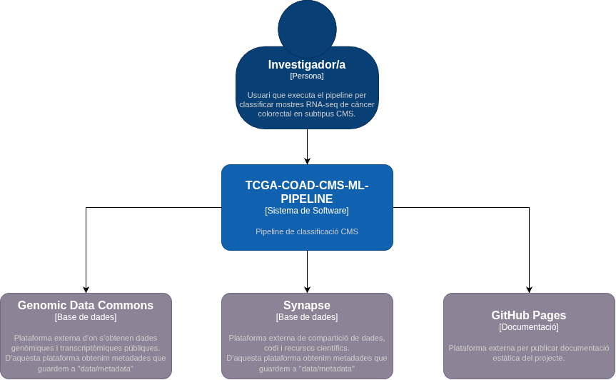
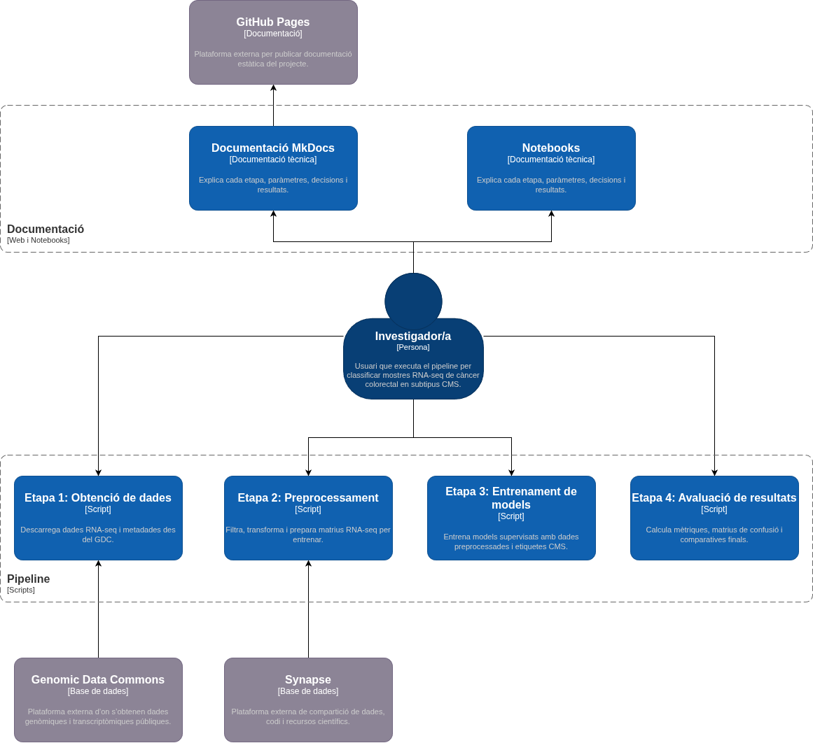
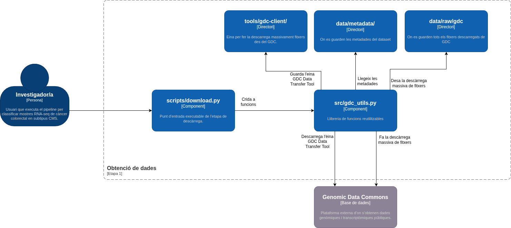
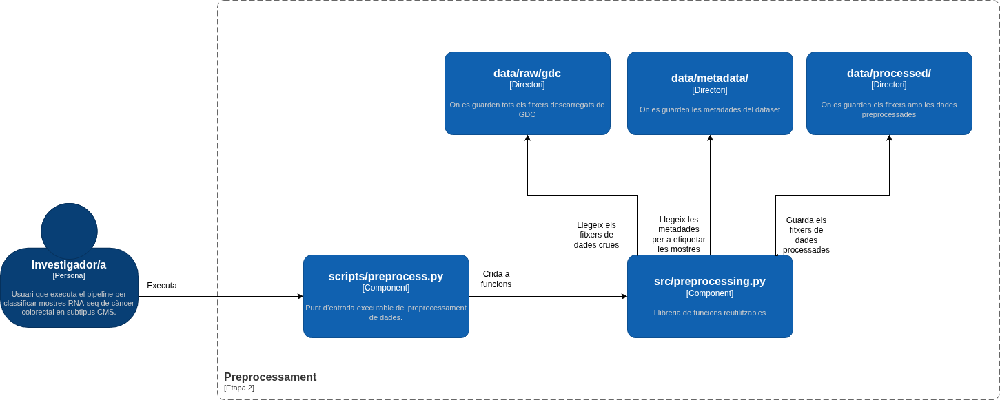
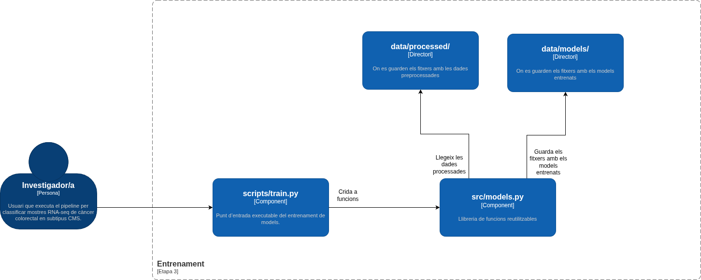
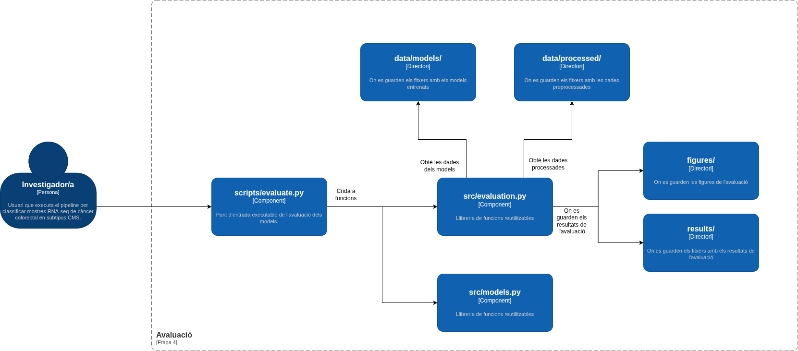

# Dades i pipeline

Aquesta pàgina descriu l’origen de les dades, l’estructura del repositori i el funcionament intern del pipeline. També inclou els diagrames C4 que representen el sistema en diferents nivells de detall.

## Origen de les dades

El projecte utilitza dades d’expressió gènica RNA-seq de la cohort TCGA-COAD. Els fitxers provenen del Genomic Data Commons i es descarreguen mitjançant un manifest guardat dins de `data/metadata/`.

El pipeline no treballa amb fitxers FASTQ ni fa alineament de seqüències. Parteix de fitxers STAR-Counts ja quantificats, que contenen comptatges d’expressió gènica per mostra.

Les etiquetes CMS provenen de recursos externs associats a Synapse i es conserven dins de `data/metadata/`. Durant el preprocessament, aquestes etiquetes s’uneixen amb les mostres RNA-seq per construir el conjunt de dades final.

| Element | Valor |
|---|---|
| Cohort | TCGA-COAD |
| Tipus de dada | RNA-seq |
| Workflow | STAR-Counts |
| Tipus de mostra | Tumor primari |
| Accés | Dades públiques del GDC |
| Etiquetes | Subtipus CMS provinents de Synapse i guardats a `data/metadata/` |

## Què es versiona i què no?

El repositori només versiona fitxers petits o necessaris per reconstruir el projecte. Les dades grans, els models entrenats i els resultats regenerables queden exclosos del control de versions.

| Ruta | Contingut | Es versiona? | Motiu |
|---|---|---|---|
| `data/metadata/` | Manifests, sample sheets i etiquetes CMS | Sí | Permeten reconstruir el dataset |
| `data/raw/gdc/` | Fitxers RNA-seq descarregats | No | Són grans i es poden descarregar de nou |
| `data/processed/` | Matrius processades | No | Es generen amb `preprocess.py` |
| `data/models/` | Models entrenats | No | Es generen amb `train.py` |
| `results/` | Informes d’avaluació | No | Es generen amb `evaluate.py` |
| `figures/` | Figures i gràfics generats | No | Es generen amb els notebooks o amb `evaluate.py` |
| `docs/assets/diagrames/` | Diagrames utilitzats per la documentació | Sí | Són necessaris per visualitzar correctament la documentació |

## Estructura del repositori

```text
tcga-coad-cms-ml-pipeline/
├── data/
│   ├── metadata/       # manifests, sample sheets i etiquetes CMS
│   ├── raw/gdc/        # fitxers RNA-seq descarregats
│   ├── processed/      # dades transformades per als models
│   └── models/         # models entrenats
├── docs/               # documentació MkDocs
├── figures/            # figures generades
├── notebooks/          # exploració i anàlisi interactiva
├── results/            # mètriques i informes d’avaluació
├── scripts/            # punts d’entrada executables
├── src/                # mòduls reutilitzables
├── tools/              # eines externes, com gdc-client
├── environment.yml
└── README.md
```

La separació entre `scripts/` i `src/` permet diferenciar els punts d’entrada executables de la lògica reutilitzable. Els scripts orquestren cada etapa del pipeline, mentre que els mòduls de `src/` contenen les funcions que poden ser cridades des dels scripts o des dels notebooks.

## Visió general del pipeline

El pipeline s’executa en quatre etapes productives:

```text
1. Descàrrega       scripts/download.py      src/gdc_utils.py
2. Preprocessament  scripts/preprocess.py    src/preprocessing.py
3. Entrenament      scripts/train.py         src/models.py
4. Avaluació        scripts/evaluate.py      src/evaluation.py
```

L’exploració amb notebooks no es considera una etapa productiva del pipeline. És una etapa d’anàlisi que ajuda a validar les dades i interpretar resultats, però no modifica els fitxers que entren als models.

## Contracte de les etapes

| Etapa | Entrada | Procés | Sortida |
|---|---|---|---|
| Descàrrega | Manifest GDC a `data/metadata/` | Localitza o instal·la `gdc-client` i descarrega els fitxers RNA-seq del GDC | Fitxers RNA-seq a `data/raw/gdc/` |
| Preprocessament | Fitxers raw, metadades i etiquetes CMS | Construeix la matriu, filtra dades, uneix etiquetes CMS, separa train/test i transforma valors | `X_train`, `X_test`, `y_train`, `y_test` i logs a `data/processed/` |
| Entrenament | Dades processades de train | Entrena Logistic Regression, Random Forest i SVM | Models `.joblib` i `training_log.json` a `data/models/` |
| Avaluació | Models entrenats i dades de test | Calcula mètriques, matrius de confusió i gràfics | Informe a `results/` i figures generades a `figures/` |

## Arquitectura C4

El model C4 s’utilitza per representar el projecte en tres nivells: context, contenidors i components. El nivell de context mostra el sistema i els elements externs; el nivell de contenidors mostra les parts principals del projecte; i el nivell de components mostra l’estructura interna de cada etapa del pipeline.

### Nivell 1: context del sistema



El diagrama de context representa el pipeline com un sistema de software complet. L’actor principal és l’investigador o investigadora, que executa el pipeline per classificar mostres RNA-seq de càncer colorectal en subtipus CMS.

El sistema es relaciona amb tres elements externs. El Genomic Data Commons proporciona els fitxers RNA-seq i les metadades de descàrrega. Synapse proporciona recursos externs relacionats amb les etiquetes CMS. GitHub Pages publica la documentació tècnica del projecte.

| Element extern | Funció dins del projecte |
|---|---|
| Genomic Data Commons | Proporciona els fitxers RNA-seq i les metadades de descàrrega |
| Synapse | Proporciona recursos externs relacionats amb les etiquetes CMS |
| GitHub Pages | Publica la documentació tècnica generada amb MkDocs |

### Nivell 2: contenidors



El diagrama de contenidors amplia el sistema i mostra les parts principals del projecte. Dins del pipeline apareixen quatre etapes productives: obtenció de dades, preprocessament, entrenament i avaluació.

També s’hi mostra la documentació com un bloc separat. Els notebooks documenten el procés d’exploració, l’anàlisi dels models i la interpretació dels resultats. La documentació tècnica es construeix amb MkDocs i es publica a GitHub Pages.

La lectura del diagrama és la següent:

1. L’investigador o investigadora executa les etapes del pipeline.
2. La primera etapa obté dades del GDC a partir de les metadades que es troben a `data/metadata/`.
3. El preprocessament etiqueta les dades usant la informació procedent de Synapse i genera dades netes a `data/processed/`.
4. L’entrenament genera models a `data/models/`.
5. L’avaluació genera resultats i figures.
6. La documentació en format notebooks explica el procés, i la documentació tècnica es publica a GitHub Pages.

## Components de cada etapa

### Etapa 1: obtenció de dades



L’etapa d’obtenció de dades té com a punt d’entrada `scripts/download.py`. Aquest script crida les funcions de `src/gdc_utils.py`, que s’encarreguen de localitzar o descarregar l’eina `gdc-client`, llegir el manifest i executar la descàrrega massiva de fitxers.

| Component | Responsabilitat |
|---|---|
| `scripts/download.py` | Punt d’entrada executable de la descàrrega |
| `src/gdc_utils.py` | Funcions per localitzar, descarregar i executar `gdc-client` |
| `tools/gdc-client/` | Directori on es guarda l’eina externa de descàrrega |
| `data/metadata/` | Directori amb manifests i metadades |
| `data/raw/gdc/` | Directori on es guarden els fitxers descarregats |

El flux principal és:

```text
scripts/download.py
        │
        ▼
src/gdc_utils.py
        │
        ├── llegeix el manifest a data/metadata/
        ├── comprova o descarrega gdc-client
        └── desa els fitxers a data/raw/gdc/
```

### Etapa 2: preprocessament



L’etapa de preprocessament transforma els fitxers RNA-seq descarregats en una matriu preparada per entrenar models. El punt d’entrada és `scripts/preprocess.py`, mentre que la lògica principal es troba a `src/preprocessing.py`.

Aquesta etapa també incorpora les etiquetes CMS procedents de Synapse i guardades a `data/metadata/`. El resultat és un conjunt de dades net, etiquetat i separat en train/test.

| Component | Responsabilitat |
|---|---|
| `scripts/preprocess.py` | Orquestra el preprocessament |
| `src/preprocessing.py` | Implementa neteja, filtratge, unió amb etiquetes, split i transformació |
| `data/raw/gdc/` | Entrada amb fitxers RNA-seq descarregats |
| `data/metadata/` | Entrada amb metadades i etiquetes CMS |
| `data/processed/` | Sortida amb matrius i logs processats |

El preprocessament s’organitza en dos blocs:

```text
Bloc 1: neteja segura abans del split
  ├── construir matriu d’expressió
  ├── eliminar files QC
  ├── filtrar gens protein-coding
  ├── deduplicar mostres
  └── unir amb etiquetes CMS

Split train/test

Bloc 2: transformacions després del split
  ├── filtrar gens amb baix comptatge usant només train
  └── aplicar log2(x + 1)
```

La separació abans i després del split evita que el conjunt de test influeixi en decisions de preprocessament que s’han de calcular només amb les dades d’entrenament.

### Etapa 3: entrenament



L’etapa d’entrenament carrega les dades processades i entrena els classificadors. El punt d’entrada és `scripts/train.py` i la lògica dels models es troba a `src/models.py`.

| Component | Responsabilitat |
|---|---|
| `scripts/train.py` | Punt d’entrada de l’entrenament |
| `src/models.py` | Funcions de càrrega de dades i entrenament dels models |
| `data/processed/` | Entrada amb `X_train` i `y_train` |
| `data/models/` | Sortida amb models entrenats |

Els models entrenats són:

- Logistic Regression.
- Random Forest.
- SVM amb kernel lineal.

Tots els models reben la mateixa matriu d’entrenament i les mateixes etiquetes. Això permet comparar-los en condicions homogènies.

### Etapa 4: avaluació



L’etapa d’avaluació carrega els models entrenats i les dades de test. El punt d’entrada és `scripts/evaluate.py`. Les funcions de càlcul de mètriques, matrius de confusió i gràfics es troben a `src/evaluation.py`.

| Component | Responsabilitat |
|---|---|
| `scripts/evaluate.py` | Punt d’entrada de l’avaluació |
| `src/evaluation.py` | Càlcul de mètriques, matrius de confusió i gràfics |
| `src/models.py` | Funcions de càrrega de dades o models quan cal |
| `data/models/` | Entrada amb models entrenats |
| `data/processed/` | Entrada amb `X_test` i `y_test` |
| `results/` | Sortida amb informes numèrics |
| `figures/` | Sortida amb figures d’avaluació |

Les sortides principals són l’informe d’avaluació a `results/` i les figures generades a `figures/`.